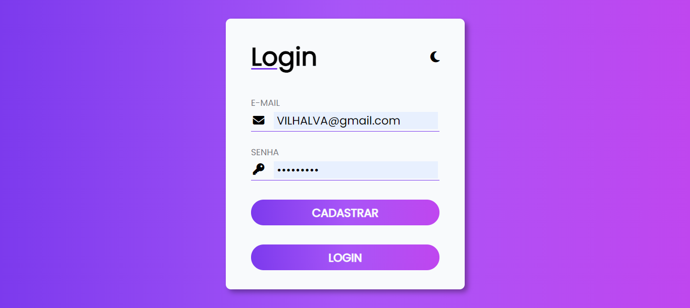
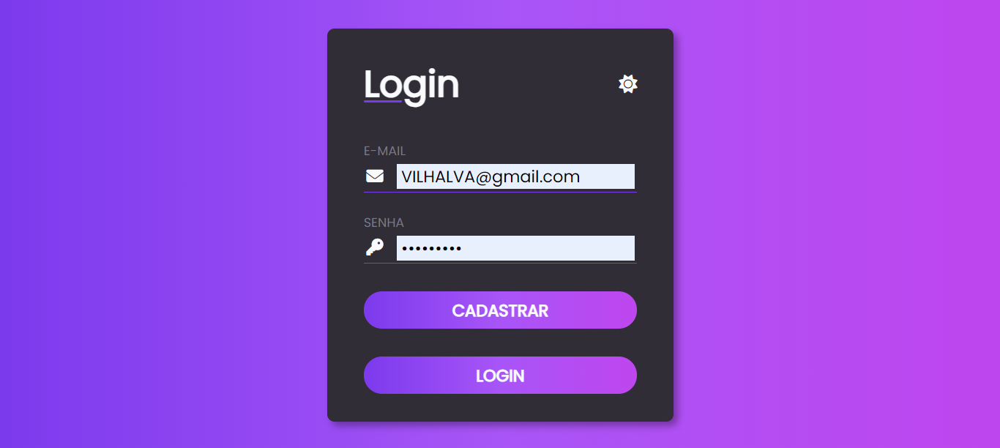
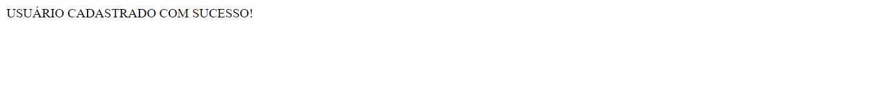
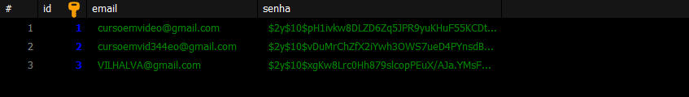

# LOGIN DARK
👨‍🏫FORMULARIO DE CADASTRO E LOGIN COM TEMA CLARO E ESCURO EM HTML, CSS, JS, PHP E MARIADB.

 <br>
 <br>
 <br>
 <br>
 <br>

## DESCRIÇÃO:
Este aplicativo web oferece funcionalidades de cadastro e login para os usuários. Também possui a funcionalidade de alternar entre modo escuro e claro. 

1. **Cadastro de Usuários:**
   - Os usuários podem se cadastrar fornecendo seu e-mail e senha.
   - Após preencher os campos necessários, o usuário pode clicar no botão "CADASTRAR" para criar sua conta.
   
2. **Login de Usuários:**
   - Usuários registrados podem fazer login fornecendo seu e-mail e senha.
   - Após preencher os campos necessários, o usuário pode clicar no botão "LOGIN" para acessar sua conta.

3. **Tema Escuro e Claro:**
   - Ícones do Font Awesome representam o modo atual (lua para escuro e sol para claro).

## EXECUTANDO O PROJETO:
1. **Configuração do Banco de Dados:**
   - Antes de executar o site, é necessário importar o arquivo `DATABASE.sql`. Se não estiver familiarizado com o processo de importação, [confira este curso](https://github.com/VILHALVA/CURSO-DE-MARIADB) para orientações detalhadas.

2. **Configuração do PHP:**
   - Abra o arquivo `CODIGO.php` e ajuste as configurações do banco de dados:

     ```php
     $servidor = "localhost";
     $username = "seu_usuario";
     $usersenha = "sua_senha";
     $database = "registro";
     ```

3. **Executando o Aplicativo:**
   - Coloque os arquivos em um servidor web compatível com PHP (por exemplo, XAMPP, WAMP, LAMP).
   - Acesse o formulário no navegador visitando `http://localhost/CODIGO/index.html`.

4. **Cadastro:**
   - Preencha o campo "SEU EMAIL" com seu endereço de e-mail.
   - Digite uma senha no campo "SUA SENHA".
   - Clique no botão "CADASTRAR" para criar sua conta.

5. **Login:**
   - Insira o e-mail cadastrado no campo "SEU EMAIL".
   - Digite a senha associada à sua conta no campo "SUA SENHA".
   - Clique no botão "LOGIN" para acessar sua conta.

6. **Mudando o Tema:**
   - Clicando no ícone, o modo muda e a classe "dark" é adicionada/removida do formulário para alterar o estilo.

## NÃO SABE?
- Entendemos que para manipular arquivos em `HTML`, `CSS` e outras linguagens relacionadas, é necessário possuir conhecimento nessas áreas. Para auxiliar nesse aprendizado, oferecemos cursos gratuitos disponíveis:
* [CURSO DE HTML E CSS](https://github.com/VILHALVA/CURSO-DE-HTML-E-CSS)
* [CURSO DE JAVASCRIPT](https://github.com/VILHALVA/CURSO-DE-JAVASCRIPT)
* [CURSO DE PHP](https://github.com/VILHALVA/CURSO-DE-PHP)
* [CURSO DE MARIADB](https://github.com/VILHALVA/CURSO-DE-MARIADB)
* [CONFIRA MAIS CURSOS](https://github.com/VILHALVA?tab=repositories&q=+topic:CURSO)

## CREDITOS:
- [PROJETO CRIADO PELO VILHALVA](https://github.com/VILHALVA)
- [PROJETO BASEADO NO "CADASTRO E LOGIN COM PHP"](https://github.com/VILHALVA/CADASTRO-E-LOGIN-COM-PHP)
- [A INTERFACE DO FORMULÁRIO FOI BASEADO NO "FORMULARIO DARK"](https://github.com/VILHALVA/FORMULARIO-DARK)


